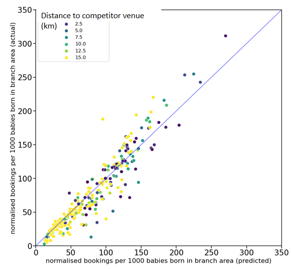

## This portfolio displays some of my data science work in Python.

  

## Project 1:
## Team project for National Childbirth Trust (NCT)
<!-- ### Description -->
### As part of Pivigo's science to data science course, I worked in a data science team with NCT. The project aim was to provide a data-driven pricing structure for NCT antenatal courses in order to optimise both funding and customer participation.
### 
### During initial exploratory analysis we collected open source and competitor data in order to describe the customer base and demand for courses in different locations accross the UK.
###
### NCT branch 'catchment areas' were defined using Voronoi tesselation based on previous customer travel patterns.
###
### A random forest regression model was developed to predict demand (demand defined as bookings per 1000 births normalised by geographical area)
###

  

#### Actual and predicted bookings per 1000 births. Colour indicates proximity to a competitor venue.

### K-means clustering was used to group NCT branches with similar customer characteristics. This was used to inform our suggested price bandings for courses in different locations.
###
### We recommend testing some of our suggested price changes to monitor the effect on bookings. As an upper estimate we expect a 6% increase in funding for the next financial year. 
<!-- ### images -->

<!-- ## Project 2: -->
<!-- ## Government petitions -->
<!-- ### Description -->
<!-- ### images -->